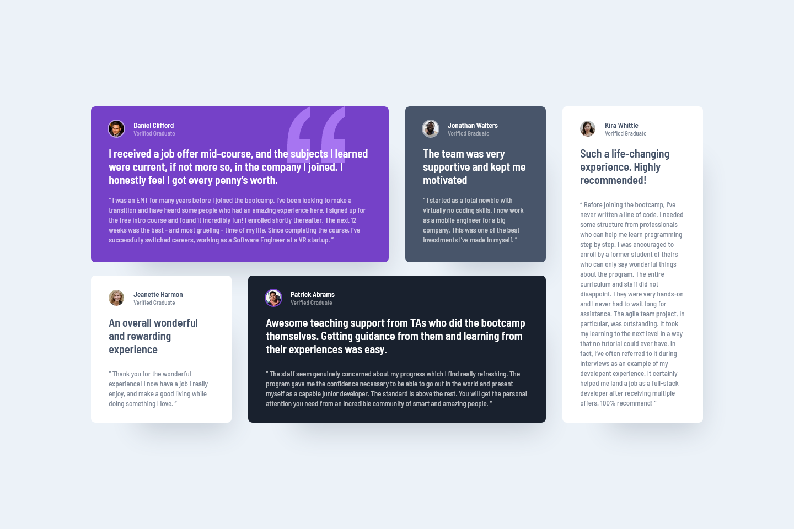

# My eleventh project and solution to the social proof section challenge over at [Frontend Mentor](https://www.frontendmentor.io/challenges)

## Table of contents
- [Assignment design](#this-was-the-design)
- [My solution with live page link](#this-is-my-solution)
- [Tools used](#tools-used)

## This was the design

## This is my solution

[Click here to see the live page](https://arthurpog.github.io/testimonials-grid-section/)

## Tools used

- **VS Code** with a few extensions:
  - **CSS Peek** - To immediately see what certain variables that I set mean and their values by holding CRTL + hovering over the value
  - **HTML to CSS Autocompletion** - Quickly autocomplete classes and ID names in CSS based on what I created in HTML
  - **Live Preview** - Right-clicking the index.html offers to view a live and constantly auto-updated version of the web-page for a quick live view of one's work
- **Greenshot** - A fantastic little open-source tool that is like a screenshot on steroids. After pressing PrtScrn it lets one exactly measure the width and height of an element on a screen basically making it very easy to calculate how big certain margins, paddings, containers and font-sizes are in a design without having access to a wire-frame.
- **Microsoft PowerToys** - A nifty little program from Microsoft adding a *plethora* of UI functionality to Windows. What I use most for coding is CTRL+WIN+C it brings up a colour picker, and when I hover over something or click something it shows me the HEX, RGB, HSL and CMYK values of the colour that can instantly be copied to the clipboard and in addition to this it keeps a history of all the colours picked. Amazing!
